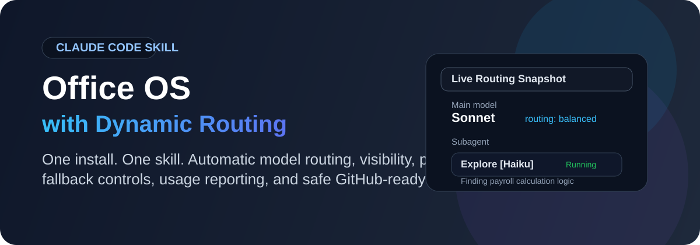
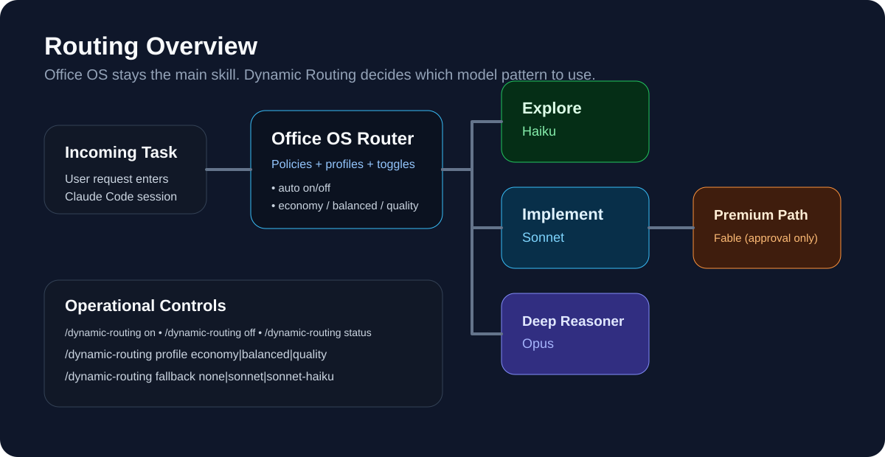
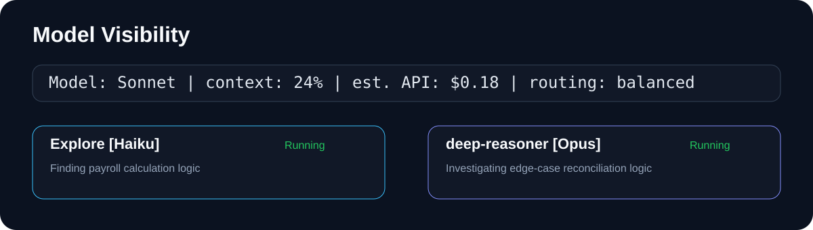

<p align="center">
  
</p>

<p align="center">
  <strong>One Claude Code skill with automatic routing, model visibility, safe installation, and GitHub-ready delivery.</strong>
</p>

<p align="center">
  
  
  
</p>

## What this repository contains

**Office OS + Dynamic Routing** combines:

- **Office OS** as the main skill entry point: `/office-os`
- **Automatic Dynamic Routing** enabled by default after install
- **Model-aware delegation**:
  - **Haiku** for exploration and lightweight discovery
  - **Sonnet** for ordinary implementation
  - **Opus** for deep reasoning and hard investigations
  - **Fable** only with explicit approval
- **Live visibility** through status line and subagent status line
- **Operational controls** for routing on/off, profiles, fallbacks, diagnostics, export, uninstall, and verification

> Dynamic Routing is **auto-activated** after installation. You do not need to run a separate routing skill.

Also bundled, under `skills/`: three additional Claude Code skills
(`brand`, `design`, `ui-ux-pro-max`) vendored from an upstream project,
unmodified. See [skills/README.md](skills/README.md) and
[skills/THIRD-PARTY-NOTICES.md](skills/THIRD-PARTY-NOTICES.md) for origin,
license, and version.

---

## Visual overview

<p align="center">
  
</p>

---

## How Claude shows the current model

<p align="center">
  
</p>

- The **main session** shows the active model, context usage, estimated API cost, and routing profile.
- Active **subagents** show their own resolved model, state, and task summary.
- When supported by Claude Code, this reflects the resolved model instead of only the requested one.

---

## Features

### Core capabilities

- Single integrated skill instead of separate Office OS and routing skills
- Automatic routing enabled after installation
- Routing controls:
  - `/dynamic-routing on`
  - `/dynamic-routing off`
  - `/dynamic-routing status`
- Routing profiles:
  - `/dynamic-routing profile economy`
  - `/dynamic-routing profile balanced`
  - `/dynamic-routing profile quality`
- Fallback controls:
  - `/dynamic-routing fallback status`
  - `/dynamic-routing fallback none`
  - `/dynamic-routing fallback sonnet`
  - `/dynamic-routing fallback sonnet-haiku`
- Compatibility checks and diagnostics
- Usage and estimated cost reporting from exported Claude JSON results
- Safe upgrade, rollback, uninstall, and conflict protection

### Safety and install behavior

- Preview-first install flow
- Preserves unrelated settings and custom status lines by default
- Stops on conflicting custom Office OS files instead of overwriting them
- Supports `CLAUDE_CONFIG_DIR` and explicit `--config-dir`
- Can upgrade pristine older routing installs with backup support

---

## Repository structure

```text
.
├── .github/workflows/        # Offline CI and installer smoke tests
├── assets/                   # README graphics and visual assets
├── docs/                     # GitHub-facing documentation
├── office-os/                # Main skill package
│   ├── SKILL.md
│   ├── agents/
│   ├── references/
│   └── routing-tools/
├── tests/                    # Regression and integration tests
├── install.sh / install.ps1  # Installers
├── verify.sh / verify.ps1    # Static verification
├── README.md
├── CHANGELOG.md
├── CONTRIBUTING.md
├── SECURITY.md
└── LICENSE
```

---

## Quick start

### Just give Claude the repo URL

Paste this into Claude Code:

```
Install the Office OS skill from https://github.com/mekapilbasnet/office-os
— clone it, then run ./install.sh --apply (or install.ps1 --apply on
Windows) and verify.sh.
```

Claude clones the repo, runs the installer, and verifies the result. No
manual steps needed on your end.

### Linux / macOS / WSL

```bash
./install.sh          # preview only
./install.sh --apply  # install
./verify.sh           # verify
```

### Windows PowerShell

```powershell
.\install.ps1
.\install.ps1 --apply
.\verify.ps1
```

After installation:

- Restart Claude Code
- Dynamic Routing is **ON** by default
- Use `/office-os` as the main skill

---

## Commands

| Command | Purpose |
|---|---|
| `/office-os` | Activate Office OS |
| `/dynamic-routing status` | Show routing status |
| `/dynamic-routing on` | Enable automatic routing |
| `/dynamic-routing off` | Disable automatic routing |
| `/dynamic-routing profile economy` | Prefer lower-cost routing |
| `/dynamic-routing profile balanced` | Use the recommended default routing behavior |
| `/dynamic-routing profile quality` | Prefer deeper reasoning |
| `/dynamic-routing fallback status` | Show current fallback mode |
| `/dynamic-routing compatibility` | Check local Claude Code compatibility |


---

## Documentation

- [Getting Started](docs/INSTALLATION.md)
- [GitHub Publishing Guide](docs/GITHUB-PUBLISHING.md)
- [Command Reference](docs/COMMANDS.md)
- [Architecture Overview](docs/ARCHITECTURE.md)
- [Original Start Here Guide](START_HERE.md)
- [Skill Behavior](office-os/SKILL.md)

---

## Testing

This repository includes:

- **42 automated tests**
- Offline regression tests
- Installer smoke tests
- GitHub Actions workflow for Linux, macOS, and Windows PowerShell
- An **opt-in live test runner** for authenticated Claude Code environments

Run local tests:

```bash
python3 -m pytest tests -q
```

> Live authenticated routing tests are intentionally opt-in and are not run automatically by CI.

---

## Publish to GitHub

1. Extract this ZIP.
2. Create a new Git repository.
3. Review `LICENSE`, `SECURITY.md`, and `CONTRIBUTING.md`.
4. Push the repository to GitHub.
5. Enable GitHub Actions if you want CI.

Detailed instructions are in [docs/GITHUB-PUBLISHING.md](docs/GITHUB-PUBLISHING.md).

---

## Notes

- Claude Code may override configured or requested models.
- This project improves routing and observability, but it **cannot force** the effective model.
- Fable remains an approval-only path.
